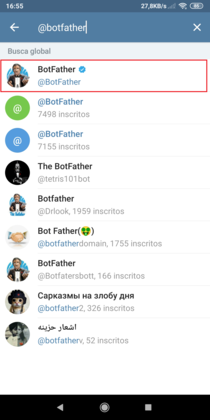
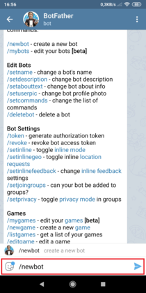
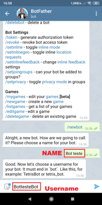
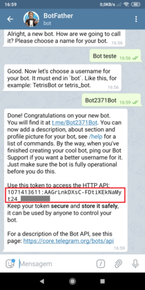

# Chatbot Telegram + Puppeteer
A ideia desse projeto é de ter os dasboards criados pelo Grafana sempre na palma da mão. O projeto foi desenvolvido dentro da [Maxmilhas](https://www.maxmilhas.com.br) pelo Marcos Gomes, que fazia parte do time de monitoramento. 

Segue o linkedin do Marcos: https://www.linkedin.com/in/marcosangomes.

Nesse projeto foi utilizado Nodejs + Puppeteer.<br/>
Nesse exemplo foi utilizado dashboards do Grafana, demo play disponibilizado pelo próprio Grafana.  
<p>Segue o link da demo play do Grafana: https://play.grafana.org</p>

#### Criando Bot no Telegram através do @BotFather.
Para que o projeto funcione corretamente, precisamos criar um Bot dentro do telegram. Com esse bot criado, iremos pegar o token do bot e configurar no projeto.

<b>1 -</b> Para poder criar o bot, basta pesquisar dentro do telegram por: <b>@BotFather</b> e clicar sobre ele;




<b>2 -</b> Envie o comando: <b>/newbot</b>;




<b>3 -</b> Inisra um <b>nome</b> para o seu bot;

<b>4 -</b> Insira um <b>unsername</b>. O username obrigatoriamente tem que terminar com a palavra bot. <b>Ex: Nossobot, Teste_bot</b>;




<b>5 -</b> Feito esses passos, você receberá um <b>Token</b>. Ele será usado dentro do projeto do Bot, configurando na variável <b>"TELEGRAM_TOKEN"</b> que está dento do arquivo <b>.env</b>;



#### Obs: Caso já tenha um TelegramBot e queira consultar seu token, basta acessar @BotFather e enviar o comando /token.

#### Iniciando a configuração do projeto.

Fazer o clone do projeto e instalar os seguintes pacotes:

```sh
$ apt install nodejs
$ apt install npm  
```

Dentro do diretório do projeto, executar os seguintes comandos:

```sh
$ npm init -y
$ npm install telegraf 
$ npm install dotenv 
$ npm install puppeteer 
$ npm install superagent  
``` 


#### Variaveis a serem alteradas no arquivo .env:

- TELEGRAM_TOKEN=inserir o token do telegram
- USERS_ID=inserir o id da conta do telegram que tera acesso ao bot
- GRAFANA_USER=inserir conta de acesso do grafana
- GRAFANA_PASS=inserir senha de acesso do grafana
- ZABBIX_USER=inserir conta de acesso do zabbix
- ZABBIX_PASS=inserir senha de acesso do zabbix

##### Obs: Para descobrir qual o id da conta do telegram, é só pesquisar no telegram pelo bot @userinfobot e digitar /start.

#### Iniciando o Bot

Para iniciar o projeto deverá executar o index.js

```sh
$ node index.js
``` 